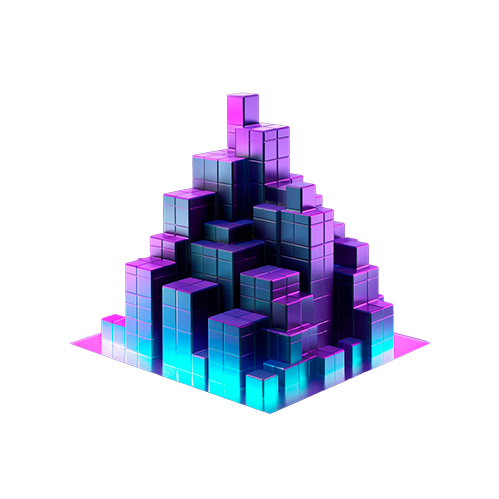
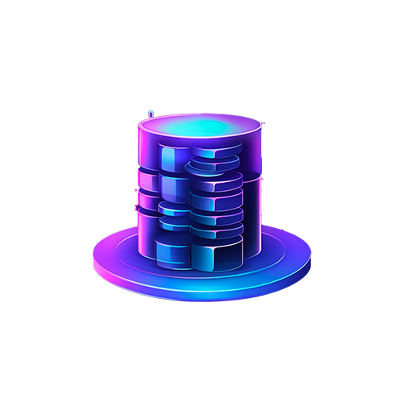
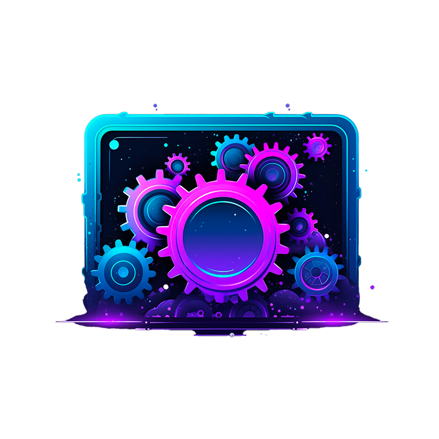
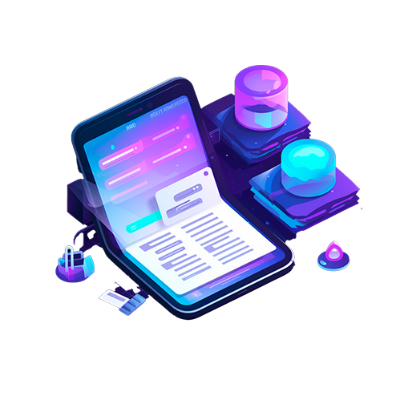

  

<h1>React Essentials</h1>

  Fundamental React concepts you will need for almost any app you are going to build!

## Core Concepts

### Components

Components are the building blocks of a React application. Each component is a piece of the user interface, which can be reused and composed to build complex UIs.

### State Management

State management refers to the practice of handling and sharing application state across various components. React provides built-in tools for managing state, such as hooks, context, and external libraries like Redux.

### Configuration

Configuration in React includes setting up the environment, using tools like Webpack or Vite for bundling, and managing dependencies with npm or yarn.

### JSX & UI

JSX is a syntax extension for JavaScript, which allows you to write HTML-like code within your JavaScript. It is used to describe what the UI should look like.
